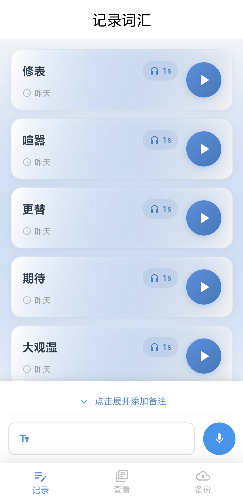
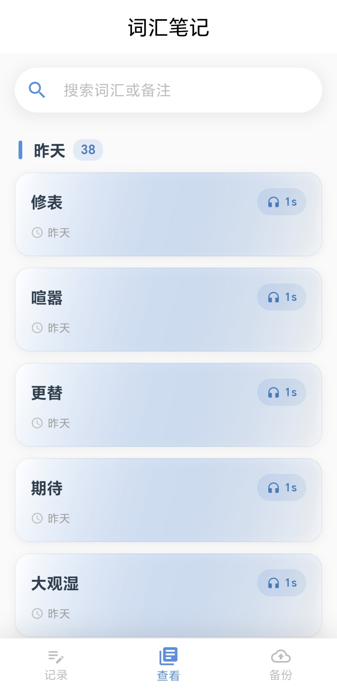
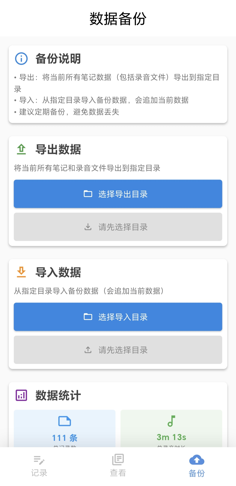

# 语记（开发版本）

<div align="center">


**极简，好用的语音学习笔记应用**


[功能特性](#-功能特性) • [快速开始](#-快速开始) • [项目结构](#-项目结构) • [技术栈](#-技术栈) • [贡献指南](#-贡献指南)

</div>

---

## 📱 应用预览

<div align="center">

| 记录 | 查看 | 备份 |
|:---:|:---:|:---:|
|  |  |  | 

*记录词汇 • 查看列表 • 管理详情 • 数据备份*

</div>

## ✨ 功能特性

### 🎯 核心功能

- **📝 词汇记录** - 快速记录词汇和句子语音，可填加备注
- **🎤 语音录制** - 长按录音，支持无时长限制
- **🔊 音频播放** - 多种播放模式
- **📚 智能分类** - 按日期自动分组（今天/昨天/本周/本月/更早）
- **🔍 实时搜索** - 支持词汇和备注内容搜索
- **💾 本地存储** - 所有数据安全存储在本地设备

### 🎨 用户体验

- **🎵 双播放模式**
  - 长按播放：按住播放，松开暂停（快速回听）
  - 标准播放：播放/暂停按钮 + 进度条
- **🔄 重新录制**：支持重新录制音频替换原有录音

### 🛡️ 数据安全

- **🔒 本地存储**：所有数据存储在设备本地，不上传云端
- **📁 文件管理**：音频文件采用 m4a 格式，高质量压缩
- **🗂️ 结构化存储**：JSON 元数据 + 音频文件分离存储

## 🚀 快速开始

### 环境要求
- JDK 17
- Flutter 3.32.2+
- Dart 3.8.1+
- Android SDK 19+
- iOS 12.0+

### 安装步骤

1. **克隆项目**
   ```bash
   git clone https://github.com/xiguagaizi/yuji.git
   cd yuji
   ```

2. **安装依赖**
   ```bash
   flutter pub get
   ```

3. **运行应用**
   ```bash
   flutter run
   ```

### 权限配置

应用需要以下权限：

- **麦克风权限**：用于录制语音
- **存储权限**：用于保存音频文件

首次使用时，应用会自动请求相关权限。

## 📁 项目结构

```
lib/
├── 📁 components/           # 可复用组件
│   ├── 🎵 audio_player/     # 音频播放组件
│   ├── 🎤 voice_recorder/   # 语音录制组件
│   └── 🔄 update_app/       # 应用更新组件
├── 📁 config/               # 配置文件
│   ├── app_config.dart      # 应用配置
│   ├── app_env.dart         # 环境变量
│   └── storage_config.dart  # 存储配置
├── 📁 models/               # 数据模型
│   └── vocabulary_record.m.dart  # 词汇记录模型
├── 📁 pages/                # 页面
│   ├── 📱 app_main/         # 主页面
│   ├── 📝 vocabulary/       # 词汇相关页面
│   └── 🔐 login/            # 登录页面
├── 📁 provider/             # 状态管理
│   ├── vocabulary_store.p.dart    # 词汇状态
│   └── theme_store.p.dart         # 主题状态
├── 📁 services/             # 服务层
│   ├── vocabulary_service.dart   # 词汇服务
│   └── backup_service.dart        # 备份服务
└── 📁 utils/                # 工具类
    ├── dio/                 # 网络请求
    └── tool/                # 通用工具
```

## 🛠️ 技术栈

### 核心框架
- **Flutter** - 跨平台UI框架
- **Dart** - 编程语言

### 状态管理
- **Provider** - 状态管理解决方案

### 音频处理
- **record** - 音频录制
- **just_audio** - 音频播放

### 数据存储
- **path_provider** - 文件路径管理
- **shared_preferences** - 轻量级数据存储

### 其他依赖
- **uuid** - 唯一标识符生成
- **intl** - 国际化支持
- **permission_handler** - 权限管理
- **fluttertoast** - 消息提示

## 📊 数据存储

### 存储结构
```
yuji_notes/
├── 📄 metadata.json          # 词汇元数据
└── 📁 audios/               # 音频文件目录
    ├── 🎵 20250121_001.m4a
    ├── 🎵 20250121_002.m4a
    └── ...
```

### 音频格式
- **格式**：m4a (AAC 编码)
- **采样率**：44100Hz
- **比特率**：128kbps
- **文件命名**：`YYYYMMDD_序号.m4a`

## 🎯 使用指南

### 添加新记录
1. 切换到「记录」标签页
2. 输入词汇或句子
3. （可选）添加备注信息
4. 长按录音按钮录制发音
5. 松开按钮结束录音
6. 试听录音，如需重新录制可点击「重新录制」
7. 点击「保存」按钮

### 查看和管理记录
1. 切换到「查看」标签页
2. 浏览按日期分组的记录列表,左滑列表可删除
3. 使用搜索框查找特定记录
4. 点击记录进入详情页
5. 在详情页可以：
   - 编辑词汇和备注
   - 播放音频
   - 重新录制音频
   - 删除记录

## 🔧 开发指南

### 构建命令

```bash
# 开发环境运行
flutter run

# 构建APK
flutter build apk

# 构建iOS
flutter build ios

# 构建Web
flutter build web
```

### 代码规范

项目使用 `flutter_lints` 进行代码检查，请确保代码符合规范：

```bash
flutter analyze
```

### 快速使用
本项目已构建APK程序，[点此下载](https://github.com/xiguagaizi/yuji/releases)

## 🤝 贡献指南

我们欢迎任何形式的贡献！

### 如何贡献

1. Fork 本仓库
2. 创建特性分支 (`git checkout -b feature/AmazingFeature`)
3. 提交更改 (`git commit -m 'Add some AmazingFeature'`)
4. 推送到分支 (`git push origin feature/AmazingFeature`)
5. 开启 Pull Request

### 问题反馈

如果您发现了 bug 或有功能建议，请通过 [Issues](https://github.com/your-username/yuji/issues) 告诉我。

## 📋 待办事项

- [ ] 📤 导出/导入功能（备份和恢复数据）
- [ ] 🏷️ 标签分类系统
- [ ] 📊 统计功能（总词汇数、总时长等）
- [ ] 🌙 深色模式支持
- [ ] ☁️ 云同步功能
- [ ] 📤 分享功能（分享单条记录）

## 📄 许可证

本项目基于 [MIT License](LICENSE) 开源协议。


---

<div align="center">

**如果这个项目对您有帮助，请给一个 ⭐️**

Made with ❤️ by [xiguagaizi](https://github.com/xiguagaizi)

</div>